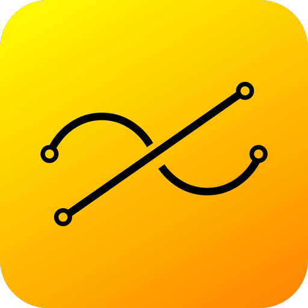
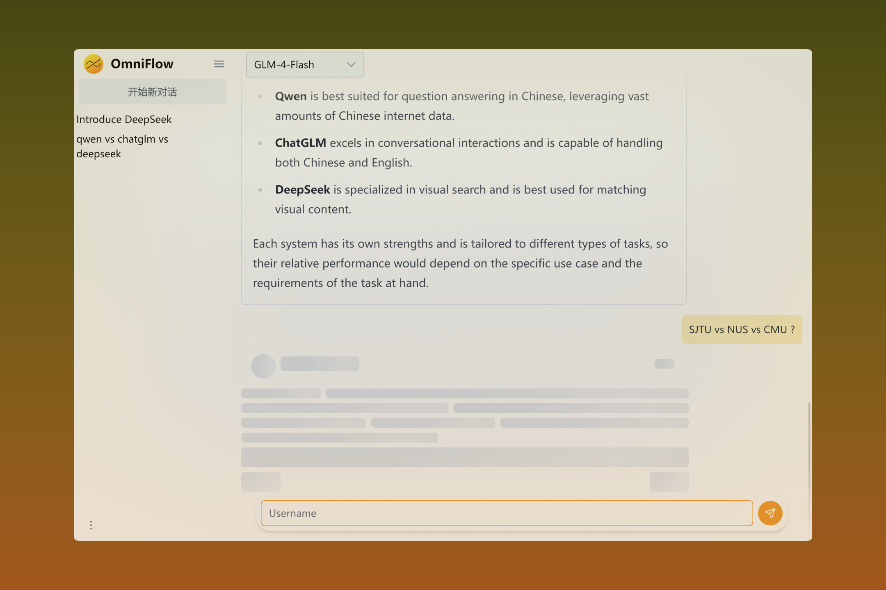

<div align="center">
</br>


</div>

<div align="center">

# OmniFlow

</div>


[](https://opensource.org/licenses/MPL-2.0)


[](https://vuejs.org/)
[](https://www.rust-lang.org/)

</br>

<div align="center">
  
</div>

</br>

OmniFLow is a feature-rich and user-friendly desktop frontend for AI conversations. It supports AI platforms like ChatGLM, DeepSeek, and Qwen. 


> [!NOTE]  
> **This Project is still in Development Stage**
>
> Stay tuned in to keep up with new features 🥰

## ✨ Features

- 🚀 Effortless Setup - No Docker or Python needed.

- ✒️ Full Markdown Support.

- 📱 Responsive Design - Built with Tailwind CSS.

- 💻 Lightweight - Powered by Tauri + Vue instead of Electron + React.

- 🌐 Web Search Integration for certain models.

### ☑️ Planned Features

- [ ] Add support for Amazon's models.
- [ ] Ollama API Integration.
- [ ] OpenAI API Integration.
- [ ] Chinese (Simplified/Traditional) translations.
- [ ] Controlled context length.
- [ ] Dialogue highlights.
- [ ] Backup & Restore functionality.
- [ ] Workflow automation.
- [ ] Context boundary visual indicators.
- [ ] Two-way double linking.
- [ ] Multi-modal support.
- [ ] Dark Mode Switch.
- [ ] Primary Color Customization.
- [ ] Mobile Support.
- [ ] Conversation Title Summary.

## 🌟 Getting Started

### 📥 Download

Check out all available packages on the [GitHub Release Page](https://github.com/dev-Vanilla/OmniFlow/releases).

[](https://github.com/dev-Vanilla/OmniFlow/releases/latest)

### 📦️ Installation

Find the corresponding package file from the [Release](https://github.com/dev-Vanilla/OmniFlow/releases) page, download, and install.


## 🛠 Devolopment

``` bash
git clone https://github.com/dev-Vanilla/OmniFlow.git
cd OmniFlow
pnpm install
pnpm tauri dev
```

> [!TIP]  
> This project is developed with Tauri + Vue 3 in Vite which uses Vue 3 `<script setup>` SFCs. Check out the [script setup docs](https://v3.vuejs.org/api/sfc-script-setup.html#sfc-script-setup) to learn more.

### Recommended IDE Setup

- [VS Code](https://code.visualstudio.com/) + [Volar](https://marketplace.visualstudio.com/items?itemName=Vue.volar) + [Tauri](https://marketplace.visualstudio.com/items?itemName=tauri-apps.tauri-vscode) + [rust-analyzer](https://marketplace.visualstudio.com/items?itemName=rust-lang.rust-analyzer)


## ⚖️ License

This project is licensed under the [Mozilla Public License 2.0 (MPL 2.0)](LICENSE).